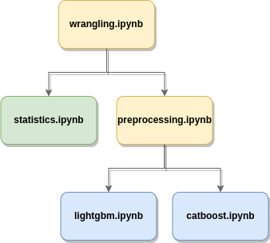

# AirBnb Data Analysis

### Table of Contents
1. [Installation](#installation)
2. [Project Motivation](#motivation)
3. [Used Data](#data)
4. [File Descriptions](#files)
5. [Results](#results)
6. [Licensing, Authors, and Acknowledgements](#licensing)


## Installation <a id="installation"></a>
The code was tested with:
1. Python 3.8
2. Ubuntu 20.4
3. Conda 4.12

<br/>Create a conda environment:
```shell
conda create --name airbnb-data-analysis python=3.8
conda activate airbnb-data-analysis
```
Install Python dependencies:
```shell
pip install -r requirements.txt
```

## Project Motivation <a id="motivation"></a>
In our data analysis we have used the dataset described in the [Used Data][#data] section to compare different 
Airbnb properties across The Netherlands. We wanted to answer to the following questions:
1. Which city has the highest price tag? What about their neighborhoods?
2. What city and neighborhoods are in most demand?
3. Are reviews for more expensive houses better?
4. What are the factors that affect a property's price?

## Used Data <a id="data"></a>
We have used the public data given by [Airbnb](http://insideairbnb.com/get-the-data/). More concrete we chose to 
perform our analysis on the biggest cities from The Netherlands:
* Amsterdam
* Rotterdam
* The Hague

**NOTE**: The code is actually generic and could be run on any other cities from Airbnb. 
But the scope of our analysis was to compare how Airbnb is performing in The Netherlands.

### Data Folder Structure
The notebooks expect the data in the following format:
```
data/
      - Amsterdam/listings.csv
      - Rotterdam/listings.csv
      - The Hague/listings.csv
```

**NOTE**: As long as you follow this folder structure you can add any other city.

## File Descriptions <a id="files"></a>
For our analysis we have used 5 files:
* `wrangling.ipynb`: ETL on different cities. Data cleaning. Business & data understanding.
* `preprocessing`: The data is prepared to be fed into different models. Data preparation.
* `statistics.ipynb`: The place were the data analysis takes place.
* `lightgbm.ipynb`: Trains a LightGBM model that predicts the price. Evaluation. Plots feature importance.
* `catboost.ipynb`: Trains a CatBoost model that predicts the price. Evaluation. Plots feature importance.

**NOTE:** We did more business & data understanding by using their [data exploration system](http://insideairbnb.com/amsterdam/).
**NOTE:** For the results we picked the best model between `LightGBM` and `CatBoost`. 

The mage below shows how the data is flowing between notebooks:
<p align="center"></p>

## Results <a id="results"></a>
The results of our data analysis is presented in detail in a Medium article called
[This Is What You Should Know When Travelling to the Netherlands With Airbnb](https://medium.com/@p.e.iusztin/this-is-what-you-should-know-when-travelling-to-the-netherlands-with-airbnb-aaa19cef4615)

## Licensing, Authors, and Acknowledgements <a id="licensing"></a>
Must be really grateful for Airbnb that they exposed their data to the public!
You can find the Licensing for the data [here](http://insideairbnb.com/data-policies). 
Otherwise, we are more than happy to use this code as you like!


